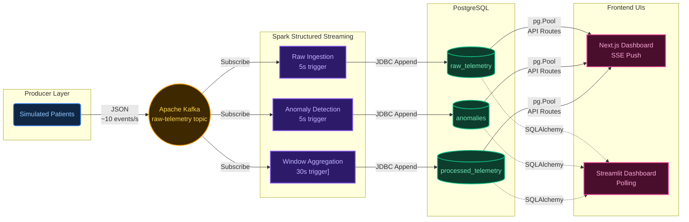

# EdgePulse
### Real-Time Physiological Telemetry Analytics

> **Big Data Analytics Project** — Kafka · Spark Structured Streaming · PostgreSQL · Next.js · Streamlit

**EdgePulse** is an end-to-end, event-driven data pipeline designed to simulate, process, and visualize physiological telemetry in real-time. Built for high-throughput healthcare analytics, it continuously ingests vital signs from simulated ICU patients via Apache Kafka, processes them using PySpark Structured Streaming for anomaly detection and sliding-window aggregations, stores the results in PostgreSQL, and serves sub-second updates to a high-performance Next.js dashboard using Server-Sent Events (SSE).

---

## 📐 Architecture



---

## 🗂️ Project Structure

```
edgepulse/
│
├── producer/                  # Telemetry generation + Kafka publishing
│   ├── patient_profiles.py    # Patient baselines + state machine
│   ├── telemetry_generator.py # Bounded random-walk vital generation
│   └── kafka_producer.py      # Kafka publisher (retries, JSON, gzip)
│
├── streaming/                 # PySpark Structured Streaming pipeline
│   ├── spark_stream.py        # Main streaming app (3 concurrent queries)
│   ├── feature_engineering.py # Sliding windows, rolling averages
│   ├── anomaly_detection.py   # Rule-based clinical anomaly detection
│   ├── stream_utils.py        # Session factory, schema, JDBC helpers
│   └── Dockerfile
│
├── web/                       # Next.js 14 Dashboard (Primary UI)
│   └── src/
│       ├── app/api/stream/    # Server-Sent Events (SSE) push endpoint
│       ├── app/api/*/         # REST endpoints for history/stats
│       ├── components/        # React components (PipelineFlow, VitalsChart, etc.)
│       └── lib/db.ts          # PostgreSQL connection pool
│
├── dashboard/                 # Streamlit real-time dashboard (Alternative UI)
│   ├── app.py                 # Main UI (cards, charts, anomaly feed)
│   ├── charts.py              # Plotly chart factory
│   └── dashboard_utils.py     # PostgreSQL query helpers
│
├── infrastructure/
│   └── postgres/
│       └── init.sql           # Schema creation + indexes
│
├── docker-compose.yml         # Full orchestration (8 services)
├── setup.sh                   # One-command setup + launch
└── README.md
```

---

## 🚀 Quick Start

### Prerequisites
- Docker Desktop ≥ 24.0
- Docker Compose v2 (`docker compose version`)

### Launch

```bash
# Clone and enter the project
cd edgepulse

# On Linux/macOS:
chmod +x setup.sh && ./setup.sh

# On Windows (Git Bash / WSL):
bash setup.sh

# Or directly:
docker compose up --build -d
```

### Access
| Service               | URL / Address           |
|-----------------------|-------------------------|
| **Next.js Dashboard** | **http://localhost:3000** |
| Streamlit Dashboard   | http://localhost:8501   |
| PostgreSQL            | localhost:5432          |
| Kafka broker          | localhost:9092          |

### Monitor Logs
```bash
docker compose logs -f producer        # telemetry events
docker compose logs -f spark-stream    # Spark processing
docker compose logs -f web             # Next.js server
```

### Stop & Clean
```bash
docker compose down          # stop containers
docker compose down -v       # stop + wipe volumes (full reset)
```

To clean just the database tables without restarting containers:
```bash
docker exec edgepulse-postgres psql -U edgepulse -d edgepulse -c "TRUNCATE TABLE raw_telemetry, processed_telemetry, anomalies RESTART IDENTITY CASCADE;"
```

---

## 🔬 Component Explanations

### 1. Telemetry Simulation
Each of the 8 simulated patients has a unique physiological baseline (age-appropriate resting HR, SpO2, temperature, respiratory rate). A **state machine** governs transitions between four behavioral states:

| State         | Description                                      |
|---------------|--------------------------------------------------|
| `normal`      | Stable vitals with small Gaussian fluctuations   |
| `elevated`    | Higher HR, slightly elevated respiration         |
| `deteriorating` | Rising HR, falling SpO2, elevated temperature |
| `recovery`    | Gradual normalization of all vitals              |

Vital signs evolve using a **bounded random walk** with state-dependent drift vectors — values are temporally continuous, not independently sampled.

### 2. Apache Kafka
Three topics are provisioned at startup. The producer publishes to `raw-telemetry` using `acks=all`, gzip compression, and micro-batching (`linger_ms=10`) for throughput.

### 3. Apache Spark Structured Streaming
Three concurrent streaming queries run independently, utilizing a `local[*]` SparkSession:

1. **Raw storage** — Parses JSON, writes every event to `raw_telemetry` (trigger: 5s)
2. **Anomaly detection** — Applies clinical threshold rules per micro-batch, deduplicates multiple rule hits keeping the highest severity (trigger: 5s)
3. **Rolling analytics** — 5-minute sliding window (1-min step) with 30s watermark → `processed_telemetry` (trigger: 30s)

Fault tolerance is provided by **checkpointing** to named Docker volumes.

### 4. Anomaly Detection Rules
| Rule                           | Type                   | Severity |
|--------------------------------|------------------------|----------|
| HR > 130 AND SpO2 < 90         | TACHYCARDIA_HYPOXEMIA  | CRITICAL |
| SpO2 < 88                      | SEVERE_HYPOXEMIA       | CRITICAL |
| HR > 120 AND SpO2 < 92         | TACHYCARDIA_LOW_SPO2   | HIGH     |
| Temperature > 39.5°C           | HIGH_FEVER             | HIGH     |
| Respiratory Rate > 30          | TACHYPNEA              | HIGH     |
| HR > 110 at rest/recovering    | RESTING_TACHYCARDIA    | MEDIUM   |
| HR < 45                        | BRADYCARDIA            | MEDIUM   |

### 5. Dashboards
**Next.js 14 Dashboard (Primary)**
- **Server-Sent Events (SSE)** for sub-second, push-based data delivery without heavy polling.
- Custom **Canvas-based animated pipeline visualization** showing live throughput.
- Recharts-powered time-series and windowed trend charts.
- Toast notifications for CRITICAL/HIGH anomalies.

**Streamlit Dashboard (Alternative)**
- Plotly-powered charts with a Python-native data manipulation backend.

### 6. Storage (PostgreSQL)
| Table                | Contents                                        |
|----------------------|-------------------------------------------------|
| `raw_telemetry`      | Every raw telemetry event with event timestamp  |
| `processed_telemetry`| Windowed per-patient aggregations               |
| `anomalies`          | Rule-triggered events with type and severity    |

Indexes are created on `patient_id` and timestamp columns to optimize dashboard query performance.

---

## 📊 Expected Outputs

After ~30 seconds of warm-up:
1. **Next.js Dashboard** shows 8 patients with live-updating metric cards via SSE.
2. **Pipeline Canvas** animates particles flowing from Kafka → Spark → DB based on live throughput.
3. **Anomalies** appear in the feed as patients enter deterioration states.
4. **PostgreSQL** accumulates rows at ~10 events/second (configurable).

---

## ⚙️ Configuration

| Environment Variable     | Default         | Description                      |
|--------------------------|-----------------|----------------------------------|
| `EVENTS_PER_SECOND`      | `10`            | Target telemetry rate            |
| `NUM_PATIENTS`           | `8`             | Active simulated patients        |
| `KAFKA_BOOTSTRAP_SERVERS`| `kafka:29092`   | Kafka broker address             |
| `DB_HOST`                | `db`            | PostgreSQL host                  |
| `DB_NAME`                | `edgepulse`     | Database name                    |

Override in `docker-compose.yml` under each service's `environment` block.
